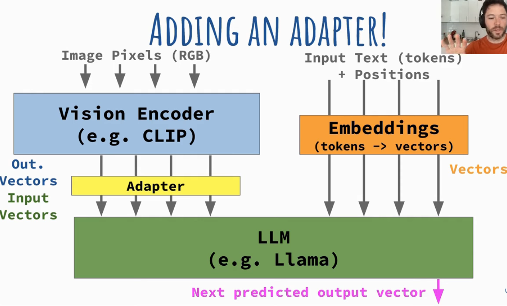
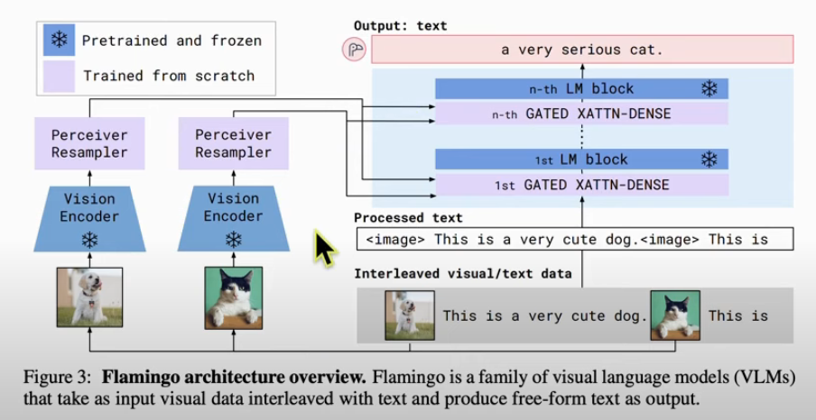

# LLAVA Model
LLAVA stands for Large Language and Vision Assistant.
LLAVA is under image-text to text tasks

## Applications
1. Photo to texts

## Architectures
Consist of a vision encoder (CLIP) and LLM (Llama)
One interesting to note is that the content (image) is prefixed before the query for next token prediction. This concept is similar to instruction finetuning. There will be also a chat template

1. LLAVA 1.5
   1. Start from pretrained Llama 2, Clip
   2. Freeze pretrained model and train adapter
   3. Unfreeze everything and train with new syntetic data from chatgpt4 (summarize image with bounding box and description)
2. LLAVA 1.6
   1. Same idea as 1.5
   2. Start from CLip and Mistral 7B/ YI 34B 
   3. Change adapter from linear layer to MLP (with activation)
3. IDEFICS
   1. Clip encoder + Llama 1
   2. Uses flamingo architecture
      1. vectors are injected to inbetween the attention layers
   3. Training using long multi image documents

4. Blip bootstrapping Language-Image Pre-training for Unified Vision-Language Understanding and Generation

## Other LLAVA variants
1. LLAVA-NEXT
2. LLAVA-NEXT-Video
3. LLAVA-Onevision
   
## Alternatives
1.  llama-3.2-vision 
2.  QWEN2-VL https://github.com/QwenLM/Qwen2-VL

## Dataset
image - caption

## Chat template
   

## Repository
1. LLAVA https://github.com/haotian-liu/LLaVA

## Tutorial
1. Fine-tune Multi-modal LLaVA Vision and Language Models: https://www.youtube.com/watch?v=eIziN2QUt8U