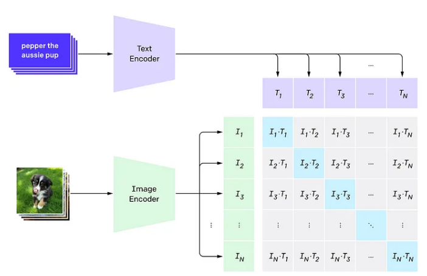

## Siglip
Siglip is a modified version if CLIP by openai where the loss was improved. Siglip and clip are multimodal vision and language transformer, the reason for using this model as opposed to a sepearated language encoder and vision encoder is because this model will be able to encode text and images into the same embeddings space. The trained model exhibit good zero shot image classification. 

## Pros/Cons vs other pretrain models
| Feature                | SliGLIP                                         | DINO                                             | Flamingo                                        | LLaVA                                           |
|------------------------|------------------------------------------------|-------------------------------------------------|------------------------------------------------|------------------------------------------------|
| **Strength in Full Image Context** | Strong due to robust global feature aggregation, enabling better understanding of overall scene semantics. | Moderate, primarily focuses on localized features, sometimes missing broader scene context. | Excellent, leveraging cross-modal attention to align global image context with text effectively. | Strong, combining pre-trained LLMs with fine-tuned visual embeddings to maintain context. |
| **Strength in Fine Image Details** | Moderate, as it emphasizes global features and may lose some finer details. | Strong, excels in capturing intricate textures and small-scale details. | Moderate, slightly weaker in fine-grained details due to focus on multimodal context. | Moderate, as fine detail understanding can be overshadowed by reliance on broader multimodal reasoning. |
| **Training Efficiency** | Highly efficient, leveraging pre-trained language models and efficient visual embeddings. | Slightly less efficient, requiring extensive fine-tuning on vision-specific datasets. | Efficient in multimodal settings but requires significant resources for training on paired data. | Moderate, leveraging pre-trained LLMs and fine-tuning visual inputs for multimodal tasks. |
| **Adaptability**        | Highly adaptable for diverse downstream tasks with minimal fine-tuning. | Requires more task-specific fine-tuning for optimal performance. | Highly adaptable, designed for multimodal applications like VQA and image captioning. | Versatile for multimodal reasoning and dialogue-oriented tasks. |
| **Scalability**         | Scales well with large datasets and multimodal inputs. | Scales effectively but primarily in vision-only domains. | Scales well in multimodal contexts but demands extensive paired data for training. | Scales effectively with multimodal datasets, focusing on dialogue-centric tasks. |
| **Primary Use Cases**   | Ideal for tasks requiring both image and text understanding, such as captioning and visual question answering. | Best suited for pure vision tasks like image classification, object detection, and segmentation. | Tailored for image-text reasoning tasks, especially in dialogue and contextual settings. | Ideal for interactive multimodal reasoning, such as visual dialogue and detailed explanations. |

## The main advantage of Siglip over Clip
1. It mainly allows the batchsize to be larger. Based on the paper, performance improved by scaling up the batchsize up to 32k.

## Architecture
Siglip/Clip mainly consist of a transformer based text and vision encoder
1. In clip "class embedding layer" is added to the image input patches (added before the first patch). This token is used as the global represention of image

## Loss function
In siglip, the loss function is modified to sigmoid so that the process can be parallized

## Dataset
1. WIT dataset (This is released by google, OpenAI did not release their dataset) https://github.com/google-research-datasets/wit

## Pretraining
Siglip and Clip are pretrained using constrastive pretraining

1. Loss function used is InfoNCELoss/NT-Xent Loss

## Pretrained weights
1. huggingface_google: https://huggingface.co/google/siglip-so400m-patch14-384

## Finetuning/Training

## Clip paper golden nuggets
1. Contrastive learning objects can learn better representation than predictive objective (Seems like we should frame the objective into a classification problem)
   1. prediction method means that we encode the image and pass image embedding features into the transformer (decoder) to predict the caption
   

## Reference
1. Clip Paper: https://arxiv.org/pdf/2103.00020
2. huggingface siglip https://huggingface.co/docs/transformers/en/model_doc/siglip
3. Contrastive Learning https://www.youtube.com/watch?v=u-X_nZRsn5M