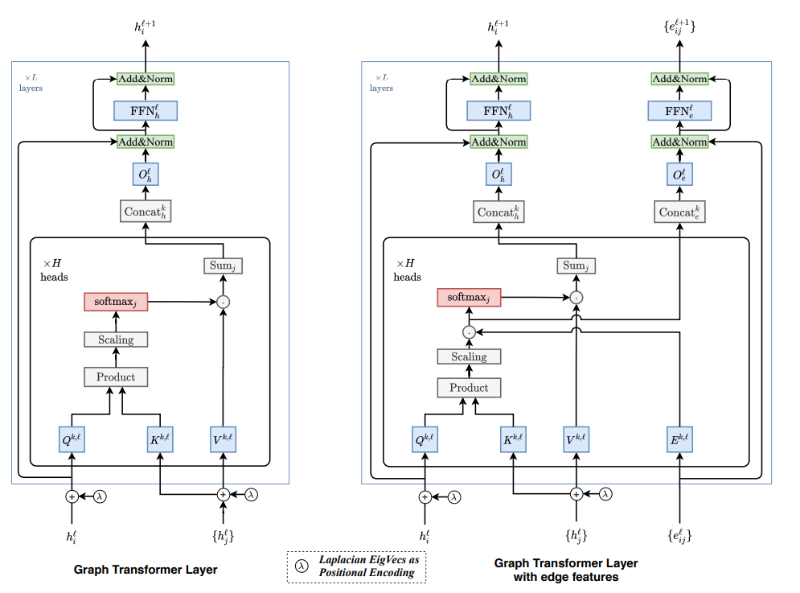

## Key Concepts in DGL
To simultaneously update all node features, the following 3 functions are used
1. message_func(edges): each edge has attributes edge = [src, dst, data]. it stores everything that needs to be done in a dictionary called mailbox which can be accessed via "nodes.mailbox"
2. reduce_func(nodes): update node features using the update equation
3. g.update_all(message_func, reduce_func) sends message through all edges and update features of all nodes
4. To implement custom layer, we need to define the message_func and reduce_func and implement the forward(graph, h) method
   1. Refer to Graph-NN.nn.MeanLayer for more information for sample implementation
   2. Most of the time, we will use DGL built in functions as they are highly optimized
5. g.apply_edge(edges): is similar to message_func but the result will be saved in the edges "recall edge batch is in the form of src, dest, data"
6. 

## Link prediction 
Link prediction is more complicated but in general, it follows the following similar process
1. randomly choose a portion of edges to be the test edges
```
edges = np.arange(g.num_edges())
edges = np.random.permutation(edges) # randomly reorder the edges

train_size= int(0.8*g.num_edges())
train_mask = edges[:train_size]
test_mask = edges[train_size:]
```

2. create a new graph (train_graph) by removing the test edges (DGL provides dgl.remove_edges(graph, edge_idx_list_to_be_removed))
```
g_main = dgl.remove_edges(g, test_mask)
```
3. create postive train and test edges pair
```
train_pos_u, train_pos_v = u[train_mask], v[train_mask]
test_pos_u, test_pos_v = u[test_mask], v[test_mask]
```
4. perform negative sampling using the full graph (not train_graph)
```
## negative edge - first create adj mat
adj = sp.coo_matrix((np.ones(len(u)), (u.numpy(),v.numpy())))
adj = adj.todense() + np.eye(g.num_nodes())
u_neg, v_neg = np.where(adj==0)

## sample negative edge ~ num of positive edges
neg_ids = np.random.choice(len(neg_u), g.num_edges())
train_neg_u, train_neg_v = u_neg[neg_ids[:train_size]],  v_neg[neg_ids[:train_size]]
test_neg_u, test_neg_v = u_neg[neg_ids[train_size:]],  v_neg[neg_ids[train_size:]]adj = sp.coo_matrix((np.ones(len(u)), (u.numpy(),v.numpy())))
adj = adj.todense() + np.eye(g.num_nodes())
u_neg, v_neg = np.where(adj==0)
```

5. Create 4 graphs
```
g_train_pos = dgl.graph((train_pos_u, train_pos_v), num_nodes=g.num_nodes())
g_train_neg = dgl.graph((train_neg_u, train_neg_v), num_nodes=g.num_nodes())
g_test_pos = dgl.graph((test_pos_u, test_pos_v), num_nodes=g.num_nodes())
g_test_neg = dgl.graph((test_neg_u, test_neg_v), num_nodes=g.num_nodes())
```
6. Train the model using g_train_pos and g_train_neg
```
def train(model,g_main, g_train_pos, g_train_neg, optimizer):
    model.train()

    h = model(g_main, g_main.ndata['feat'])

    pos_scores = model.predict(g_train_pos, h)
    neg_scores = model.predict(g_train_neg, h)

    loss = model.loss(pos_scores, neg_scores)
    
    optimizer.zero_grad()
    loss.backward()
    optimizer.step()

    auc_score = model.auc_score(pos_scores, neg_scores)

    return loss, auc_score

```
7. Evaluate using g_test_pos and g_test_neg
```
@torch.no_grad()
def evaluation(model, g_main, g_val_pos, g_val_neg):
    model.eval()
    
    h = model(g_main, g_main.ndata['feat'])

    pos_score = model.predict(g_val_pos, h)
    neg_score = model.predict(g_val_neg, h)

    loss = model.loss(pos_score, neg_score)

    auc_score = model.auc_score(pos_score, neg_score)

    return loss, auc_score
```
## Heterogenous graph format in DGL
1.  Nodes/Edges of different types have independent ID space and feature storage
2.  The message passing on heterographs can be split into two parts:
    1.  Message computation and aggregation for each relation r.
    2.  Reduction that merges the aggregation results from all relations for each node type.

```python
graph_data = {
    ('user_id', 'link', 'transaction'): (torch.tensor([0,1]), torch.tensor([1,2])),
    ('transaction', 'link', 'user_id'): (torch.tensor([1,2]), torch.tensor([2,1])),
    ('ci', 'link', 'transaction'): (torch.tensor([0,1]), torch.tensor([2,3])),
    ('transaction', 'link', 'ci'): (torch.tensor([2,3]), torch.tensor([0,1]))
}
num_node_dict = {
    'user_id':5,
    'ci': 20,
    'transaction':4
}

g = dgl.heterograph(graph_data,num_node_dict)
g.nodes['user_id'].data['hv'] = torch.ones(5,1)
print("num edges for this type", g.num_edges(('ci', 'link', 'transaction')))
g.edges[('ci', 'link', 'transaction')].data['he']= torch.ones(2,2)

## Create edge type subgraph
sub_graph = dgl.edge_type_subgraph(g, [('user_id', 'link', 'transaction'),('transaction', 'link', 'user_id')])


## Add bidirectional edges
g = dgl.to_bidirected(g)

## Message passing
import dgl.function as fn

for c_etype in g.canonical_etypes:
    srctype, etype, dsttype = c_etype
    Wh = self.weight[etype](feat_dict[srctype])
    # Save it in graph for message passing
    G.nodes[srctype].data['Wh_%s' % etype] = Wh
    # Specify per-relation message passing functions: (message_func, reduce_func).
    # Note that the results are saved to the same destination feature 'h', which
    # hints the type wise reducer for aggregation.
    funcs[etype] = (fn.copy_u('Wh_%s' % etype, 'm'), fn.mean('m', 'h'))
# Trigger message passing of multiple types.
G.multi_update_all(funcs, 'sum')
# return the updated node feature dictionary
return {ntype : G.nodes[ntype].data['h'] for ntype in G.ntypes}
```
## Heterogenous model and training loop sample for node classification

```python
class RGCN(nn.Module):
    def __init__(self, in_feats:int, hidden_feat:int, out_feat:int, rel_names:list[str]):
        super().__init__()
        self.conv1 = dglnn.HeteroGraphConv({
            rel: dglnn.GraphConv(in_feats, hidden_feat) # rel is based on edge type
            for rel in rel_names
        }, aggregate='sum')

        self.conv2 = dglnn.HeteroGraphConv({
            rel: dglnn.GraphConv(hidden_feat, out_feat)
            for rel in rel_names
        }, aggregate='sum')

    def forward(self, graph:dgl.graph, inputs:dict):
        h = self.conv1(graph, inputs) # returns a dictionary similar to input
        h = {node_type:F.relu(features) for node_type, features in h.items()}
        h = self.conv2(graph, h)
        return h

# hetero_graph.etypes = ['clicked-by', 'disliked-by', 'click', 'dislike', 'follow', 'followed-by']
model = RGCN(n_hetero_features, 20, n_user_classes, hetero_graph.etypes)
user_feats = hetero_graph.nodes['user'].data['feature']
item_feats = hetero_graph.nodes['item'].data['feature']
labels = hetero_graph.nodes['user'].data['label']
train_mask = hetero_graph.nodes['user'].data['train_mask']


node_features = {'user': user_feats, 'item': item_feats}
h_dict = model(hetero_graph, {'user': user_feats, 'item': item_feats})
h_user = h_dict['user'] # torch.Size([1000, 5])
h_item = h_dict['item'] # torch.Size([500, 5])

opt = torch.optim.AdamW(model.parameters())
for epoch in range(10):
    model.train()
    logits = model(hetero_graph, node_features) # [num_node, class]
    loss = F.cross_entropy(logits['user'], labels) # label: [num_node]
    
    opt.zero_grad()
    loss.backward()
    opt.step()
    print(loss.item())

```

## Heterogenous model and training loop sample for edge predict 
```python
class HeteroDotProductPredictor(nn.Module):
    def forward(self, graph, h, edge_type):
        with graph.local_scope():
            graph.ndata['h'] = h
            graph.apply_edges(fn.u_dot_v('h','h','score'), etype= edge_type)
            return graph.edges[edge_type].data['score']

class MLPPredictor(nn.Module):
    def __init__(self, in_features, out_classes):
        super().__init__()
        self.linear = nn.Linear(in_features, out_classes)

    def apply_edges(self, edges):
        h_u = edges['src']['h']
        h_v = edges['dst']['h']
        score = self.linear(torch.concat([h_u,h_v],1)) 
        return {'score':score}
        

class Model(nn.Module):
    def __init__(self, in_features, hidden_features, out_features, rel_names):
        super().__init__()
        self.sage = RGCN(in_features, hidden_features, out_features, rel_names)
        self.pred = HeteroDotProductPredictor()
    def forward(self, g, x, etype):
        h = self.sage(g, x)
        return self.pred(g, h, etype)

model = Model(10, 20, 5, hetero_graph.etypes)
user_feats = hetero_graph.nodes['user'].data['feature']
item_feats = hetero_graph.nodes['item'].data['feature']
label = hetero_graph.edges['click'].data['label']
train_mask = hetero_graph.edges['click'].data['train_mask']
node_features = {'user': user_feats, 'item': item_feats}

opt = torch.optim.Adam(model.parameters())
for epoch in range(10):
    pred = model(hetero_graph, node_features, 'click')
    loss = ((pred[train_mask] - label[train_mask]) ** 2).mean()
    opt.zero_grad()
    loss.backward()
    opt.step()
    print(loss.item())

```


## Graph formats
1. coo
2. csr
3. csc

   
## GAT
The main idea of GAT is the calulation of the the atttention coefficient and store it in the edge data
    1. first do a linear projection from the input feature
    2. use apply edges to apply a MLP on the concatentation of the src and dst hidden later to output coefficient
    3. message pass the projected feature from (1) and edge_data from (2) into destination node mailbox
    4. aggregate on the (coefficient * neighbour feature) 


## GraphTransformer
Paper:https://arxiv.org/pdf/2012.09699
Architecture


1. Uses laplacian Positional Encoding
2. The calculated attention is sparsed as it is multiplied by the adj matrix


## Scaling up to large graphs
1. Mini batch training
   1. Still have to load the full graph into CPU memory
   2. We will use dgl.dataloading.NodeDataLoader to get all the input nodes(features), output node(labels) and the block/bipartite graph
   3. Sampling methods 
      1. Neighborhood sampling (GraphSage)
      2. Control Variate base sampling (VRGCN)
      3. Layer wise sampling (FastGCN)
      4. Random-walk-based sampling (Pinsage)
      5. Subgraph sampling (ClusterGCN, GraphSAINT)
   4. For full set (non sampled) validation, we will compute layer by layer (setting MultilayerNeigbour sampler as None)
      1. 2 for loops, outer loop is for the number of layers and the inner loop is the for minibatches of Nodes
   5. For Link prediction, we can use dgl.dataloading.EdgeDataLoader for negative edge sampling
2. DDP training
   1. Each GPU is assigned a 'rank' and we assign a partiion of the nodes for each GPU
   2. Wrap the model using DistibutedDataParallel
   
3. Fully Distributed training
   1. The first step for distributed training is to partition the graph
   2. 4 components (all machine will have all 4 components)
      1. trainining component
      2. sampling component
      3. parameter server
      4. feature storage component
   3. Steps to used distributed training
      1. dgl.distributed_initialize
      2. pytorch distributed initialize
      3. create a distributed.DistGraph
      4. split nodes using dgl.distributed.node_split
   4. Partitioning algorithm
      1. Metis (Recommended)
      2. Random
   5. DistGraph
      1. 2 modes (distributed and standalone-for model development)
   6. DisTensor
      1. Have additional argument called name
      2. creating dist tensor is a synchronious process
   7. DisEmbedding 
      1. Important for algorithms that uses embeddings like deepwal
      2. can only be updated using DGL sparse optimizer
   8. Train-Test Split
      1. Uses global mask tensor in g.ndata['train_mask']
   9.  In distributed training, the nodes are remapped to be for optmization purposes so during inference, the reverse lookup has to be done
   
   

## Tutorial references
1. dgl basics: https://www.youtube.com/watch?v=RABd6rnI84Y&list=PL8ser0zRo_NhRIoBkBcSdUooNZdrM5WkI
   1. https://github.com/dtdo90/Deep_Graph_Library_Tutorials/blob/main/01_gcn.ipynb

2. Scaling up graph in DGL: https://www.youtube.com/watch?v=xEadtVuIMWg&list=PLLAnU7epK3yizI65mVD_iBd-5yvN-K8lm
   1. https://github.com/dglai/KDD20-Hands-on-Tutorial/tree/master/3-basics