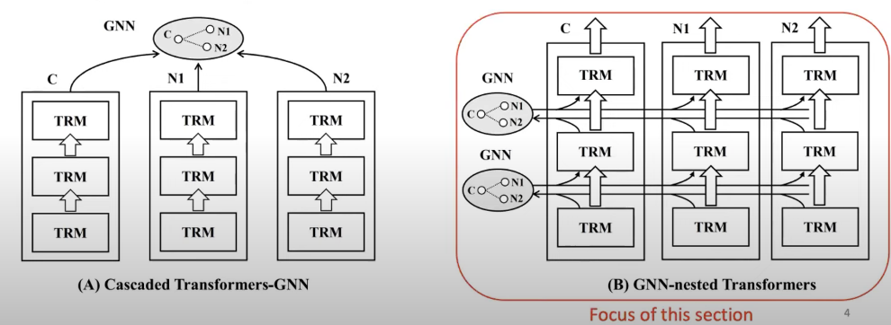

## Text Attributed Graph Representation learning (GraphFormer)
1. Cascaded Transformer-GNN
   1. Apply LM on document first then feed into GNN
   2. This method do not allow interaction between GNN and LM
2. GNN nested Transformer
   1. Allow interaction between GNN and LM

## Nested Transformer
1. Use 1 layer transformer to embedd input tokens into transformer token embedding
2. Graph Aggregation using CLS token (whole document embedding) to generate graph embedding
3. Concat (graph embedding and transformer token embedding)
4. Repeat 1-3 for N layers
5. Loss is calculated using contrastive loss using in batch negative sampling
6. The trained model is then used for embedding generation for downstream tasks

## Heteroformer
1. Text rich and Textless nodes are treated seperately
2. Textless nodes are randomly initialized embedding
3. Text rich follows the homogenous methods
4. Aggregation 
   1. Textless neighbour
      1. concat(graph embedding, testless embedding)
   2. Text rich follows the homogenous method
5. concat textless and text rich neighbours with token embedding
6. repeatfor L layers
7. Contrastive link prediction loss

## Edgeformer

## References
1. https://www.youtube.com/watch?v=7Qm2vxMj0vE