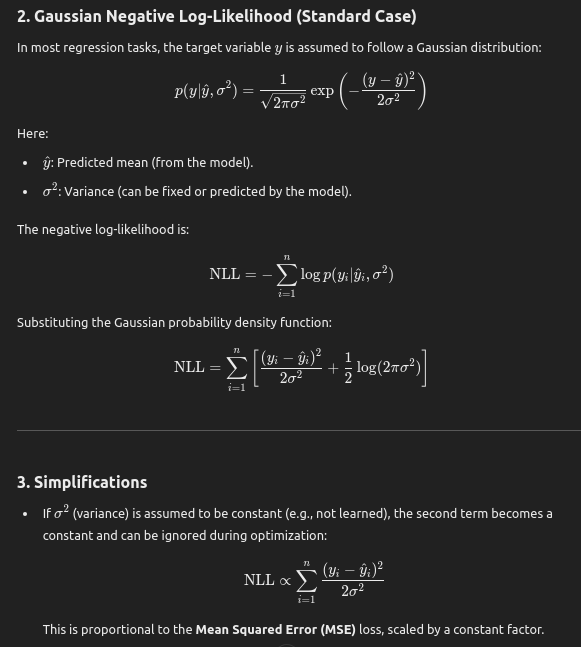

## Loss Functions
Maximum Likelihood is about fitting a distribution to the data.Distributions are more general and easier to work with.

1. Cross Entropy (Negative log likelihood for classification task)
   1. https://www.youtube.com/watch?v=Pwgpl9mKars
2. KL-Divergence
3. RMSE/MSE 
   1. When we use this for regression task, we are assuming that the continuous distribution variable is normally distributed
   