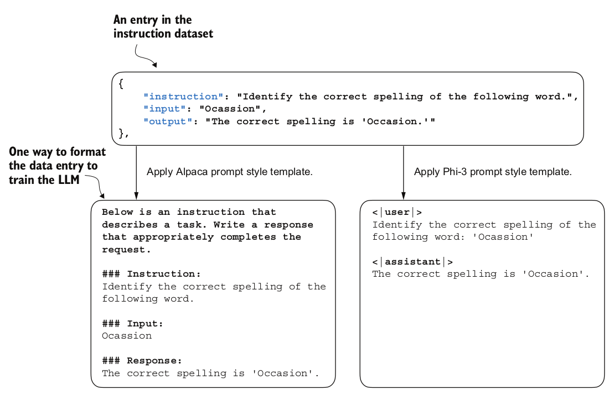
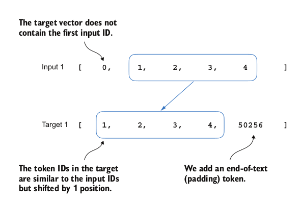
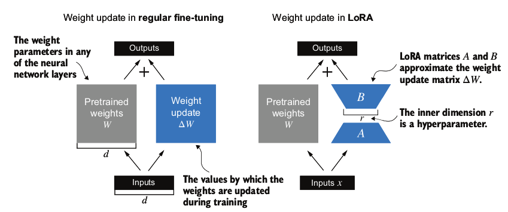

## How to utilize LLM
1. API from openai, antropic etc
2. Local/private server
   1. https://github.com/vllm-project/vllm
   2. https://github.com/ollama/ollama (built on top of llama.cpp)
   3. https://github.com/ggerganov/llama.cpp
   4. https://github.com/nomic-ai/gpt4all
   5. https://github.com/Mozilla-Ocho/llamafile
   6. https://github.com/janhq/jan
   7. https://github.com/Lightning-AI/litgpt


## Main features of LLM architecture
1. Multihead self attention
2. Causal Masking by chaning trilu to -torch.inf
3. Additional attention dropouts using nn.Dropout (note that the rest of the attention will be scaled by 1/dropout_rate)
4. attention scores are scaled by hidden_dim ** -0.5
5. Dropout are added to attention weight after softmax to prevent overfitting
6. Layer Normalization (usually before and after multiheaded attention module)
   1. Layer norm have trainable parameter for scaling and shifting 
   2. Layer norm is applied to the feature/hidden dim
7. Gelu Activation

## Loss functions
1. During pretraining (next token prediction)
   1. cross entropy loss 
   2. Alternative metric is perplexity 

## Decoding strategies
1. temperature scaling
2. top-k sampling
```python
def generate(model, idx, max_new_tokens, context_size, temperature=0.0, top_k=None, eos_id=None):
    for _ in range(max_new_tokens):
        idx_cond = idx[:, -context_size:]
        with torch.no_grad():
            logits = model(idx_cond)
        logits = logits[:, -1, :]
        if top_k is not None:
            top_logits, top_pos = torch.topk(logits, top_k)
            min_val = top_logits[:, -1]
            logits = torch.where(logits<min_val, torch.tensor(float('-inf')).to(logits.device), logits)

        if temperature > 0.0:
            logits = logits / temperature
            probs = torch.softmax(logits, dim=-1)
            idx_next = torch.multinomial(probs, num_samples=1)
        else:
            idx_next = torch.argmax(logits, dim=-1, keep_dim=True)

        if idx_next == eos_id:
            break

        idx = torch.cat((idx, idx_next), dim=1)
    return idx
```

## Stages of training LLM
1. Building LLM model
   1. Data preparation and sampling
2. Pretraining Foundation model (Usually only done in large enterprises)
3. FineTuning for personal assistant (Instruction) / Classifer etc
   1. Preference tuning can help boost Instruction fine-tuning (Generate Multiple responses and choose 1 to me better)
4. Continue pretraining: Adding latest knowledge

## Creating dataset for LLM training
The dataset for pretraining LLM is done via data sampling with sliding window


## LLM Training framework
1. Nvidia Nemo: https://github.com/NVIDIA/NeMo


## Positional Encoding
1. There are 2 broad categories of positional encoding
   1. relative positional embeddings (LLAMA RoPE)
   2. absolute positional embeddings (GPT)

## Instruction finetuning
1. dataset format
   1. input maybe empty
```
 {'instruction': 'Edit the following sentence for grammar.', 'input': 'He go to the park every day.', 'output': 'He goes to the park every day.'}

 {'instruction': "What is an antonym of 'complicated'?",
'input': '',
'output': "An antonym of 'complicated' is 'simple'."}
```

2. Similar to Next token prediction, the labels are shifted by 1

3. WE can choose to perform masking on the target (eg changing the token to -100) to ignore them during cross entropy calculation
4. 

## LORA
Lora stands for low rank adaptation, that uses 2 matrices to approximate the updates to the original weights so the the original weights can be frozen which dramatically reduces the memory requirement during training (* most of the GPU memory are used in the gradient and gradient related parameters like momentum)


```python
class LoRALayer(torch.nn.Module):
    def __init__(self, in_dim, out_dim, rank, alpha):
        super().__init__()
        self.A = torch.nn.Parameter(torch.empty(in_dim, rank))
        torch.nn.init.kaiming_uniform_(self.A, a=math.sqrt(5))
        self.B = torch.nn.Parameter(torch.zeros(rank, out_dim))
        self.alpha = alpha
    def forward(self, x):
        x = self.alpha * (x @ self.A @ self.B)
        return x

class LinearWithLoRA(torch.nn.Module):
    def __init__(self, linear, rank, alpha):
        super().__init__()
        self.linear = linear
        self.lora = LoRALayer(
        linear.in_features, linear.out_features, rank, alpha
        )
    def forward(self, x):
        return self.linear(x) + self.lora(x)

def replace_linear_with_lora(model, rank, alpha):
    """
    Before using this function, we will freeze all the original weights by changing param.requires_grad = False
    """
    for name, module in model.named_children():
        if isinstance(module, torch.nn.Linear):
            setattr(model, name, LinearWithLoRA(module, rank, alpha))
        else:
            replace_linear_with_lora(module, rank, alpha)
```


## Evaluation of LLM
1. MMLU: measuring massive multitask language understanding
2. AlpacaEval: measure against GPT4
3. LMSYS chatbot arena: Crowd sourcing eval


## Tutorial
1. Overview of LLM development: https://www.youtube.com/watch?v=kPGTx4wcm_w

## Reference
1. Build LLM from scratch book: https://github.com/rasbt/LLMs-from-scratch


## Opensource LLMs / Datasets
1. List of opensource LLM and datasets https://github.com/eugeneyan/open-llms