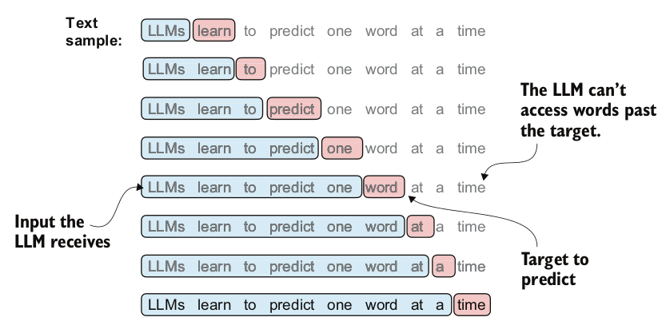

## How to utilize LLM
1. API from openai, antropic etc
2. Local/private server
   1. https://github.com/vllm-project/vllm
   2. https://github.com/ollama/ollama (built on top of llama.cpp)
   3. https://github.com/ggerganov/llama.cpp
   4. https://github.com/nomic-ai/gpt4all
   5. https://github.com/Mozilla-Ocho/llamafile
   6. https://github.com/janhq/jan
   7. https://github.com/Lightning-AI/litgpt

## Main features of LLM architecture
1. Multihead self attention
2. Causal Masking by chaning trilu to -torch.inf
3. Additional attention dropouts using nn.Dropout (note that the rest of the attention will be scaled by 1/dropout_rate)
4. attention scores are scaled by hidden_dim ** -0.5
5. Dropout are added to attention weight after softmax to prevent overfitting
6. Layer Normalization (usually before and after multiheaded attention module)
   1. Layer norm have trainable parameter for scaling and shifting 
   2. Layer norm is applied to the feature/hidden dim
7. Gelu Activation

## Loss functions
1. During pretraining (next token prediction)
   1. cross entropy loss 
   2. Alternative metric is perplexity 

## Stages of training LLM
1. Building LLM model
   1. Data preparation and sampling
2. Pretraining Foundation model (Usually only done in large enterprises)
3. FineTuning for personal assistant (Instruction) / Classifer etc
   1. Preference tuning can help boost Instruction fine-tuning (Generate Multiple responses and choose 1 to me better)
4. Continue pretraining: Adding latest knowledge

## Creating dataset for LLM training
The dataset for pretraining LLM is done via data sampling with sliding window

## LLM Training framework
1. Nvidia Nemo: https://github.com/NVIDIA/NeMo

## Positional Encoding
1. There are 2 broad categories of positional encoding
   1. relative positional embeddings (LLAMA RoPE)
   2. absolute positional embeddings (GPT)

## Evaluation of LLM
1. MMLU: measuring massive multitask language understanding
2. AlpacaEval: measure against GPT4
3. LMSYS chatbot arena: Crowd sourcing eval

## Tutorial
1. Overview of LLM development: https://www.youtube.com/watch?v=kPGTx4wcm_w

## Reference
1. Build LLM from scratch book: https://github.com/rasbt/LLMs-from-scratch

## Opensource LLMs / Datasets
1. List of opensource LLM and datasets https://github.com/eugeneyan/open-llms