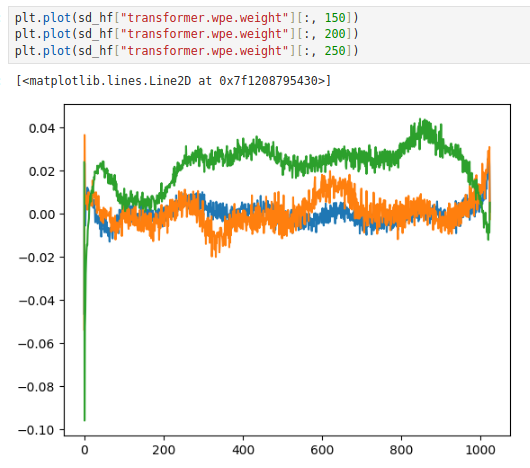

## Keypoints
1. we can plot out the the positional embedding layer for each channel to look at the graph
   -    an untrained model should show an random graph




2. Clean residual pathways are desirable
```python
class Block(nn.Module):
    def __init__(self, config: GPTConfig):
        super().__init__()
        self.ln_1 = nn.LayerNorm(config.n_embd)
        self.attn = CausalSelfAttention(config)
        self.ln_2 = nn.LayerNorm(config.n_embd)
        self.mlp = MLP(config)

    def forward(self, x):
        x = x + self.attn(self.ln_1(x))
        x = x + self.mlp(self.ln_2(x))

        return x

```

3. Attention is the "reduce" operation where weights interact with each other
4. MLP is the "mapping" operation where the weights dont interact with each other

## Initialization
1. initialize linear and embedding weights using uniform
    - for residual path, we need to scale the weights by  (2 * number of layers) ** -0.5
2. initialize bias to zeros

## Speeding up training
1. Tensor core are 4 X 4 matrices so make sure our tensor sizes are multiples of 4s / 2s
2. Improving GPU calculation speed 
   1. Tfloat multiplication
   2. Automix precision
      1. BF16 maintain the range but F16 reduce the range of value so scaling is required
      2. auto mix precision will have a speed up of around 10% but have lower memory usage
   
```python
torch.set_float32_matmul_precision("high") ## Will only work on newer GPU where the matrix multiplication is faster

## For Volta ** only surround the forward pass and loss calculation
scaler = torch.cuda.amp.GradScaler()
with torch.autocast(device_type=device, dtype=torch.float16):
    logits, loss = model(x, y)

scaler.scale(loss).backward()
scaler.step(opt)
scaler.update()
opt.zero_grad()

## For Ampere onwards where bfloat16 is avaliable
with torch.autocast(device_type=device, dtype=torch.bfloat16):
    logits, loss = model(x, y)
```
3. torch.compile() ** Only works for compute capability of >=7.0, Expect >2x improvements
   
```python
model = GPT(GPTConfig())
model.to(device)
model = torch.compile(model)
```
4. FlashAttention
```python
## old code
att = (q @ k.transpose(-2, -1)) * (1.0 / math.sqrt(k.size(-1)))
att = att.masked_fill(self.bias[:, :, :T, :T] == 0, float("-inf"))
att = F.softmax(att, dim=-1)
y = att @ v  # (B, nh, T, T) x (B, nh, T, hs) -> (B, nh, T, hs)

## new code
y = F.scaled_dot_product_attention(q, k, v, is_causal=True)

```
5. Change all ugly numbers like 3, 5. to nice numbers
6. gradient clipping 
```python

loss.backward()
norm = torch.nn.utils.clip_grad_norm_(model.parameters(), 1.0)

```
7. Learning rate scheduler
```python

max_lr = 6e-4
min_lr = max_lr * 0.1
warmup_steps = 10
max_steps = 50
def get_lr(it):
    # 1) linear warmup for warmup_iters steps
    if it < warmup_steps:
        return max_lr * (it+1) / warmup_steps
    # 2) if it > lr_decay_iters, return min learning rate
    if it > max_steps:
        return min_lr
    # 3) in between, use cosine decay down to min learning rate
    decay_ratio = (it - warmup_steps) / (max_steps - warmup_steps)
    assert 0 <= decay_ratio <= 1
    coeff = 0.5 * (1.0 + math.cos(math.pi * decay_ratio)) # coeff starts at 1 and goes to 0
    return min_lr + coeff * (max_lr - min_lr)

for step in range(max_step):
    loss = model(x)
    loss.backward()
    norm = torch.nn.utils.clip_grad_norm(model.parameters(), 1.0)
    optimizer.step()

    lr = get_lr(step)
    for param_group in optimizer.param_groups:
        param_group['lr'] = lr

```
8. weight decay and setting fused to true
   1. It is common not to decay biases

```python
def configure_optimizers(self, weight_decay, learning_rate, device):
    # get all params that requires grad
    param_dict = {pn: p for pn, p in self.named_parameters()}
    param_dict = {pn: p for pn, p in param_dict.items() if p.requires_grad}
    # create optim groups
    decay_params = [p for n, p in param_dict.items() if p.dim() >= 2]
    nodecay_params = [p for n, p in param_dict.items() if p.dim() < 2]
    optim_groups = [
        {"params": decay_params, "weight_decay": weight_decay},
        {"params": nodecay_params, "weight_decay": 0.0},
    ]
    num_decay_params = sum(p.numel() for p in decay_params)
    num_nodecay_params = sum(p.numel() for p in nodecay_params)
    print(
        f"num decayed parameter tensors: {len(decay_params)}, with {num_decay_params:,} parameters"
    )
    print(
        f"num non-decayed parameter tensors: {len(nodecay_params)}, with {num_nodecay_params:,} parameters"
    )
    fused_available = "fused" in inspect.signature(torch.optim.AdamW).parameters
    use_fused = fused_available and "cuda" in device
    print(f"using fused AdamW: {use_fused}")
    optimizer = torch.optim.AdamW(
        optim_groups, lr=learning_rate, betas=(0.9, 0.95), eps=1e-8, fused=use_fused
    )
    return optimizer
```
9. gradient accumulation **** Important thing to note is that we need to divide the loss by the grad acc steps as that is the normalized batch loss
```python
total_batch_size = 1024  # 2**19, ~0.5M, in number of tokens
B = 2  # micro batch size
T = 256  # sequence length
assert (
    total_batch_size % (B * T) == 0
), "make sure total_batch_size is divisible by B * T"
grad_accum_steps = total_batch_size // (B * T)
print(f"total desired batch size: {total_batch_size}")
print(f"=> calculated gradient accumulation steps: {grad_accum_steps}")
train_loader = DataLoaderLite(B=B, T=T)

## training loop
for microstep in range(grad_accum_steps):
    x, y = train_loader.next_batch()
    x, y = x.to(device), y.to(device)
    with torch.autocast(device_type=device, dtype=torch.float16):
        logits, loss = model(x, y)

    loss = loss / grad_accum_steps ## *** need to normalize by the number of steps
    # norm = torch.nn.utils.clip_grad_norm_(model.parameters(), 1.0)
    scaler.scale(loss).backward()

scaler.step(optimizer)
scaler.update()
```

10. DDP using torchrun
    1.  Take note that we need to seed torch and torch.cuda and random so that the model that are created on each node is the same
    2.  We need to warp the model in DDP using **ddp local rank
        1.  if we are calling other function other than forward, we will need to use model.module.function_call
    3.  We can use no_sync context manager for gradient accumulation
    4.  If want to sync other parameters, we can use torch.distributed.all_reduce(variable, op=dist.ReduceOp.Avg)


```python
ddp = int(os.environ.get("RANK", -1)) != -1
if ddp:
    assert torch.cuda.is_available()
    init_process_group(backend="nccl")
    ddp_rank = int(os.environ["RANK"])
    ddp_local_rank = int(os.environ["LOCAL_RANK"])
    ddp_world_size = int(os.environ["WORLD_SIZE"])
    device = f"cuda:{ddp_local_rank}"
    torch.cuda.set_device(device)
    master_process = ddp_rank == 0

else:
    ddp_rank = 0
    ddp_local_rank = 0
    ddp_world_size = 1
    master_process = True
    if torch.cuda.is_available():
        device = "cuda"
    elif hasattr(torch.backends, "mps") and torch.backends.mps.is_available():
        device = "mps"  # apple silicon
    else:
        device = "cpu"
    print("Using", device)ddp = int(os.envir)

...

grad_accumulation_step = total_batch_size // (B*T*ddp_world_size) # we need to a adjust the accum steps


if master_process:
    print("Master")
    # Print
    # Saving

if ddp: # after torch.compile
    from torch.nn.parallel import DistributedDataParallel as DDP
    model = DDP(model, device_ids=[ddp_local_rank])


if ddp:
    destroy_process_group()

```
```bash
torchrun --standalone, --nproc_per_node=1 script.py
 
```