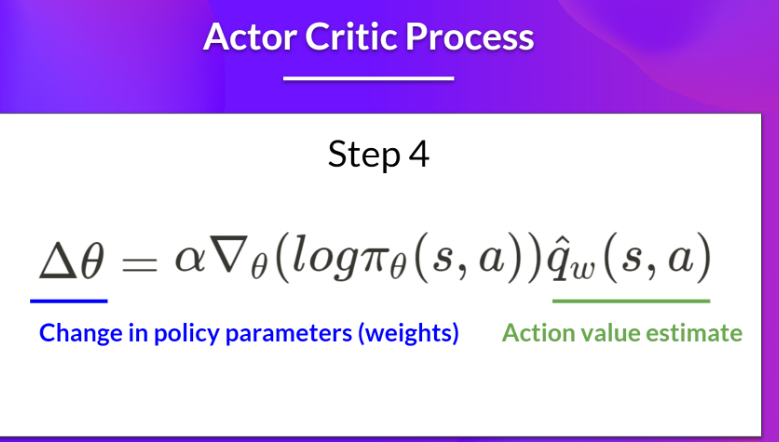

## Key Concepts
1. Markov decision process assumes that the probability of next state is only dependent on previous state, a discretized version is call the bellman equation
2. RL agents do not maximizes the Reward but the Expected reward (Q-Functions/Action values) given the learn policy
3. Deep Q Networks uses neural nets because the (Q / Action values) for each action is too huge as there are infinite number of state, action combinations
4. The are online RL where the labels are not defined at the start of offline RL where there are precollected labels
5. Different between state and observation is that state is the full information about the environment (eg chess game), observations is the partial information about the state (eg super mario)
6. There are 2 types of tasks, episodic(game, have start and end) and continuous task(stock trading)
7. There are 2 ways to train the policy, 
   1. policy-based method (which action to take)
      1. Deterministic where policy will always return a same action given the same state
      2. stochastic where there is a probability distribuion over the different actions
   2. value-based method(which state is more valuable), In this method, we want to find the optimal value function that leads to having optimal policy
      1. Traditional method - creates Q table
      2. Deep learning method - where the number of states is too huge
8. there 2 types of value based function
      1. State-Value E(s): the expected return if the agent starts at that state and follows the policy
      2. Action-Value E(s,as): Output the expected return if the agent starts at the start and takes that action and follow the policy 
9. Monte Carlo vs Temporal Difference Learning
      1. In monte carlo, the agent updates the value function after the entire episode (uses actual reward at that state)
      2. In Temporal Difference, the agent update the value function after the next step (uses the discounted value of next state)

## RL algorithms
1. Q-Learning: Action Value based method that uses temporal difference approach (update after each step)
   1. If we have the optimal Q-function, we will have the optimal policy as we know what action to take at each action-state
   2. Q-learning is an off-policy algorithm as the policy for acting (episilon greedy) is different from updating
   3. Algorithm
      1. Select an action based on epsilon-greedy method
      2. get reward based on action taken in (1)
      3. update Q-table using TD equation 

2. Deep Q-learning This method is similar to Q-learning but uses deep learning to approximate the Q-table
   1. Training contains 2 phases
      1. Sampling: we perform actions and store the observed experience tuples in a replay memory.
      2. Trianing: Select a small batch of tuples randomly and learn from this batch using a gradient descent update step.
   2. To stablize training,
      1. Use experience replay to make use of experiences
      2. fixed Q-target to stabilize training
      3. double Q-Learning to handle the problem of overestimation of Q-values
   
3. Policy-Gradient Method (More suitable in more scenarious as real life actions are not discrete)

   1. Policy Gradient method are more effective in high-dimensional action space
   2. In policy gradient generates a smooth probability distribution over all the actions
   3. Very often, policy gradient method converges to local maximum instead of global optimum
   4. Expected cumulative reward J is the summation of the product of Probability of taking the trajectory and the reward of taking the trajectory
      1. As it is impossible to calculate for all trajectories, we will use a sample based method 
   5. Monte-Carlo policy-gradient
      1. Use policy to collect an episode
      2. Estimate the policy gradient (steepest increase in return)
      3. update the weights (policy)
4. Actor-Critic method
This method is a hybrid between value-based and policy based methods
An actor controls how our agent behaves (Policy)
A critic measures how good the taken action is (Value-Based Method)
   1. Advantage Actor Critic (A2C) 
      1. In this method, we learn 2 function approximations
         1. A policy to controls how our agent acts
         2. a value function to assist the policy update by measuring how good the action taken is
   Actor and critic receive the state and Actor outputs and action to environment and critic
   
   Critic takes the state and action and compute the Q value
   
   Action performed outputs a new state and reward
   
   Policy is updated using following equation
   
   Critic then updates its value parameter
   
   We can use Advantage function instead of value function by comparing the Q-value to the average Value of that state
   
5. Proximal Policy Optimization
This method improves the agent's training stability by avoiding policy updates that are too large 
   1. update ratio is clipped to [1−ϵ,1+ϵ]
   Clipped surrogate obejctive function
   

   Final A2C with PPO
   

   
### Reward function
1. Curiosity reward
   1. One of the issue with reinforcement learning is the the reward are sparses (+1 for hitting the objective). This will cause a "cold" start proklem where the agent is going around in circles.
   2. curiousity reward is an instrisic (vs extrinsic aka hand crafted reward)
   3. curiosity encourages the agent to explore path that are new
   4. There are a few ways to calculate prediction error
      1. Curiosity using next-state prediction: error of our agent in predicting the next state, given the current state and action taken

### RL Libraries abd simulators
1. OpenAI Gym: https://github.com/openai/gym
2. StableBaseline: https://github.com/DLR-RM/stable-baselines3
3. CleanRL: https://github.com/vwxyzjn/cleanrl
4. Google Dopamine: https://github.com/google/dopamine
5. Gymnasium: https://github.com/Farama-Foundation/Gymnasium
6. recsim: https://github.com/google-research/recsim
7. Unity Ml-agent https://github.com/Unity-Technologies/ml-agents

### Tutorial
1. Foundation of RL 6 part lecture:https://www.youtube.com/watch?v=2GwBez0D20A&list=PLwRJQ4m4UJjNymuBM9RdmB3Z9N5-0IlY0 
2. Policy Gradient and actor critic method lesson: https://www.youtube.com/watch?v=y3oqOjHilio

### Reference
1. Reinforcement learning in recommender systems: https://www.youtube.com/watch?v=qJysTu1Xl5U, 
   - git:https://github.com/anyscale/academy/tree/main/ray-rllib/acm_recsys_tutorial_2022
2. huggingface RL course: https://huggingface.co/learn/deep-rl-course/en/unit0/introduction
3. Markov decision process: https://www.anyscale.com/blog/reinforcement-learning-with-deep-q-networks

## 