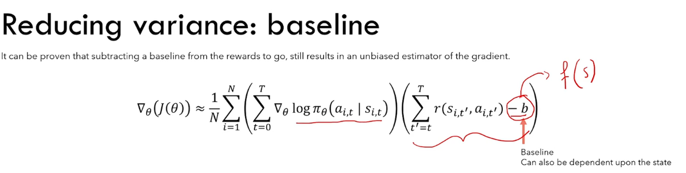
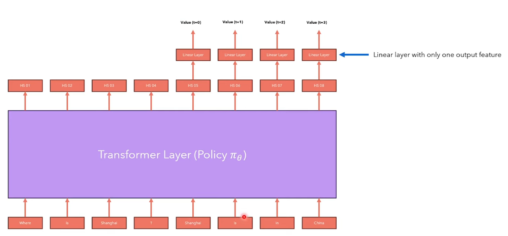
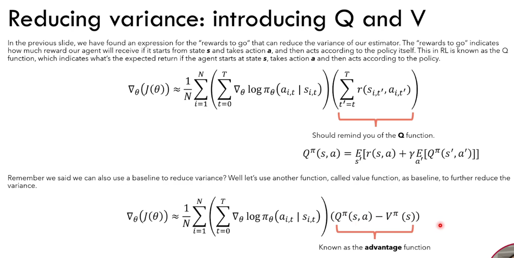
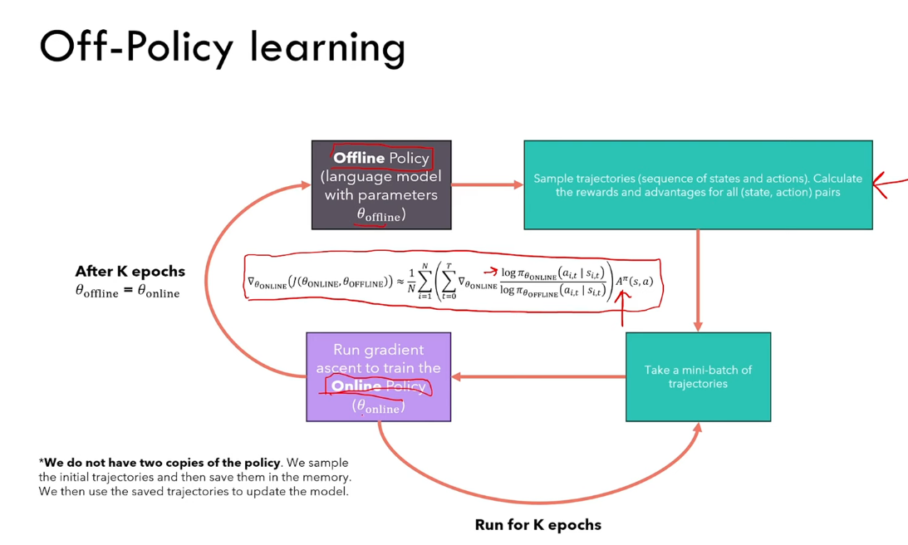
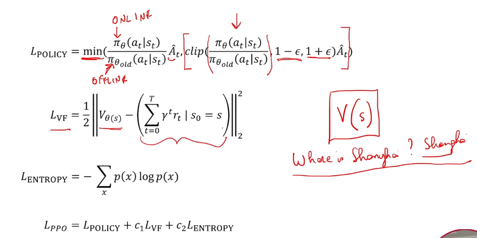
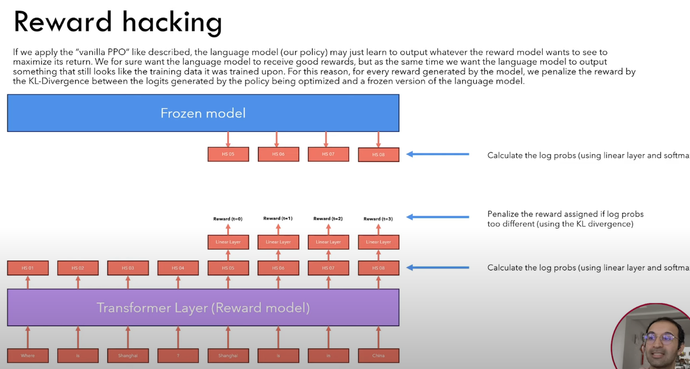
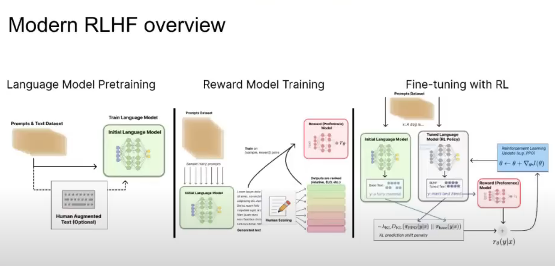
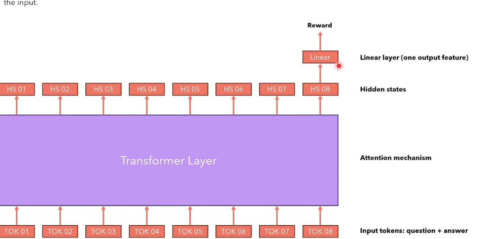
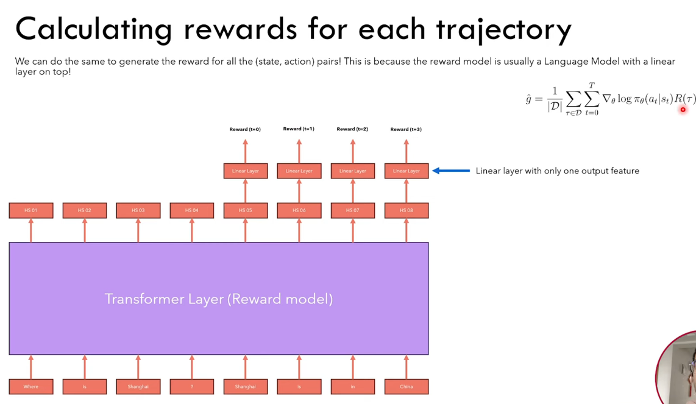

## Key concepts
1. Uses Policy gradient algorithm (optimize policy directly as opposite to value state function)
2. The objective is to maximise the the expected return from the reward model (which is another transformer model)
3. As we cannot calculate the the expected reward over all trajectory, we will do sampling but this creates high variance issue. In order to reduce the variance, we can do the following
   1. calculate the trajectory from that state onwards to remove the historical terms (Rewards to go)
   2. Use a baseline (we can use value function V(state) -> This value function can be the same LLM model)
   
   
   
   3. importance sampling and off policy sampling
      1. we sample based on the old policy and keep it in memory.
      2. optimize the policy for a number of steps
      3. update old policy with updated policy
   
   4. PPO loss
      1. Policy Loss 
      2. Value state 
      3. Entropy - encourage the model to explore more
   
   5. Reward hacking using KL divergence
      1. We want the language model to produce outputs that are similar to the original model
   

   
 ## Steps in RLHF
 1. LM pretraining + supervised prompt tuning (expensive)
 2. Reward model training (tuned for human preferences)
    1. Use multiple model to generate many texts for human scoring
    2. Train the model to predict the score
 3. Fine tuning with RL 
  
   

## Direct Preference Optimization (DPO)
1. In DPO, the algorithm optimize the policy directly without the use of a reward model

## Reward Model
The reward model is also a transformer model but with only 1 output on the last token position

Calculating the reward for the trajectory

## References
1. huggingface RLHF: https://www.youtube.com/watch?v=2MBJOuVq380
